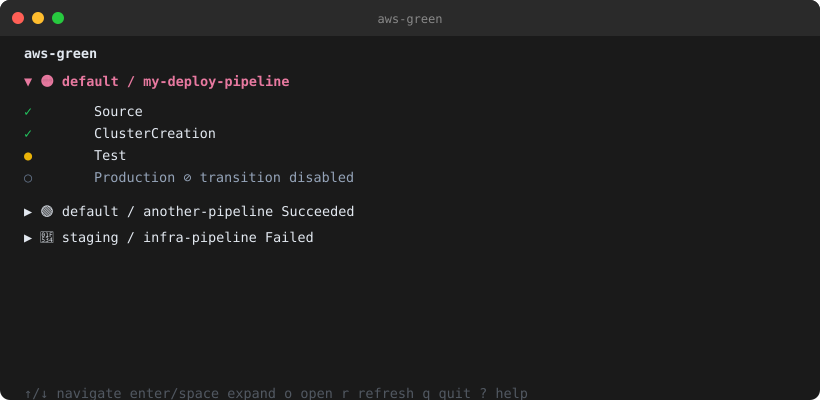

# aws-green

### get your projects green

A terminal dashboard for live AWS resource health across multiple accounts and regions — CodePipeline, CloudFormation, and ECS — no browser required.



## Features

- **Stoplight-per-project** — 🟢 🔴 🟡 ⚪ derived from worst-case across pipeline, CloudFormation stacks, and ECS services
- **Per-resource-type summary** — collapsed row shows `Pipeline 🟡  Stacks 🟢  ECS 🟢` at a glance
- **Stage-level expand** — expand any project to see pipeline stages, stack statuses with elapsed timers, and ECS running/desired task counts
- **Active-first sorting** — in-progress and failing projects surface to the top automatically
- **Inline expand/collapse** — navigate with `↑`/`↓`, toggle any row with `enter`/`space`
- **Auto-polling** — refreshes every 30 seconds (configurable); retains last-known status on API errors
- **CloudFormation monitoring** — maps stack status to stoplight; in-progress stacks show elapsed timer
- **ECS service monitoring** — shows running/desired task counts; flags active deployments. Stopped-task detail is fetched only for services that are actually unhealthy, so a green fleet costs one call per cluster
- **Throttle-aware** — AWS clients use the SDK's adaptive retry mode, self-throttling before AWS has to reject a burst
- **Stuck alerts** — POSTs a signed JSON event to your webhooks when a pipeline, stack, or service stays wedged past a threshold, once per incident
- **Multi-account** — per-account AWS profile config with named profiles or environment credentials
- **In-TUI project management** — add, edit, delete, and enable/disable projects without leaving the terminal
- **Interactive init** — `aws-green init` writes a starter config via a terminal form
- **Single binary** — no runtime, no dependencies

## Install

### Homebrew

```bash
brew install ericdahl-dev/tap/aws-green
```

As of v0.4.0, aws-green is published as a Homebrew **cask** rather than a formula — GoReleaser removed the formula config this project used. New installs need no change. If you installed before v0.4.0 you are on the old formula, which is frozen and no longer receives updates; move across once with:

```bash
brew uninstall aws-green
brew install --cask ericdahl-dev/tap/aws-green
```

### Go

```bash
go install github.com/ericdahl-dev/aws-green@latest
```

## Usage

```bash
aws-green            # launch the dashboard
aws-green init       # write a starter config
aws-green --version  # print the version
aws-green --help     # show usage
```

## First-time config

Run an interactive wizard (writes `~/.config/aws-green/config.toml`):

```bash
aws-green init
```

Use `aws-green init --force` to overwrite an existing file.

## Config

Create `~/.config/aws-green/config.toml` by hand, or start from `aws-green init` and edit:

```toml
[settings]
poll_interval_seconds   = 30
stuck_threshold_minutes = 30   # optional; how long a resource stays bad before it alerts

[[accounts]]
name    = "production"
profile = "prod"
region  = "us-east-1"

[[projects]]
name    = "my-app"
account = "production"
# enabled = false          # optional; disable without deleting (no API calls made)

  [projects.pipeline]
  name = "my-app-DeploymentPipeline-abc123"

  [[projects.stacks]]
  name = "my-app-cluster"

  [[projects.stacks]]
  name = "my-app-service"

  [[projects.ecs]]
  cluster  = "my-app-FargateCluster-xyz789"
  services = ["my-app-web", "my-app-worker"]

[[webhooks]]
url    = "https://hooks.example.com/aws-green"
secret = "shared-secret"        # optional; enables request signing
```

### Stuck alerts

A dashboard only helps when someone is looking at it. Configure one or more
`[[webhooks]]` and aws-green POSTs a JSON event the moment a resource has been
wedged for longer than `stuck_threshold_minutes` (default `30`):

- **Pipeline** — a stage of the latest execution is `Failed`/`Stopped`, or still `InProgress`
- **CloudFormation stack** — any `*_IN_PROGRESS` or `*_FAILED` status
- **ECS service** — running task count does not match desired

Each wedged resource fires **once**, on the cycle it crosses the threshold — not
every poll. Once it recovers it is re-armed, so the next incident alerts again.
Pipelines whose fetch failed (expired SSO session, throttling) are skipped so a
credential problem is not reported as a broken deploy.

```json
{
  "event": "pipeline_stuck",
  "reason": "pipeline_in_progress",
  "project": "my-app",
  "account": "production",
  "region": "us-east-1",
  "resource_type": "pipeline",
  "resource": "my-app-DeploymentPipeline-abc123",
  "status": "InProgress",
  "detail": "stage Deploy",
  "stuck_since": "2026-01-02T03:04:05Z",
  "timestamp": "2026-01-02T03:35:05Z"
}
```

`event` is one of `pipeline_stuck`, `stack_stuck`, `ecs_service_stuck`; `reason`
is one of `pipeline_failed`, `pipeline_in_progress`, `stack_failed`,
`stack_in_progress`, `ecs_count_mismatch`. ECS events also carry `cluster`.

When a webhook has a `secret`, the request is signed with HMAC-SHA256 over the
raw body and sent as `X-Aws-Green-Signature: sha256=<hex>` — verify it before
trusting the payload. Delivery failures are never retried and never interrupt
polling; run with `AWS_GREEN_DEBUG=1` to see them on stderr.

### Using the default AWS profile

If all your resources live in one account, omit `[[accounts]]` and leave `account` blank — aws-green will use your default AWS profile and region:

```toml
[[projects]]
name = "my-app"

  [projects.pipeline]
  name = "my-deploy-pipeline"

  [[projects.stacks]]
  name = "my-app-stack"
```

### Authentication

aws-green uses the standard AWS credential chain via `aws-sdk-go-v2`. Any of these work:

- Named profiles in `~/.aws/config` (recommended — set `profile` in `[[accounts]]`)
- AWS SSO via `aws sso login`
- Environment variables (`AWS_ACCESS_KEY_ID`, `AWS_SECRET_ACCESS_KEY`, etc.)
- IAM instance/task roles when running on AWS

## Keybindings

### Dashboard

| Key | Action |
|---|---|
| `↑` / `k` | Navigate up |
| `↓` / `j` | Navigate down |
| `enter` / `space` | Expand / collapse project row |
| `r` | Force refresh |
| `f` | Smart fix (restart pipeline / force deploy / continue rollback) |
| `o` | Open pipeline in AWS Console |
| `m` | Open project manager |
| `q` | Quit |
| `?` | Toggle help overlay |
| `esc` | Close help overlay |

### Project manager (`m`)

| Key | Action |
|---|---|
| `↑` / `k` | Navigate up |
| `↓` / `j` | Navigate down |
| `t` / `space` | Toggle enable / disable |
| `a` | Add project |
| `e` | Edit project |
| `d` | Delete project |
| `esc` | Back to dashboard |

Changes are written to `config.toml` immediately and the poller reloads automatically. Disabled projects make no AWS API calls.
